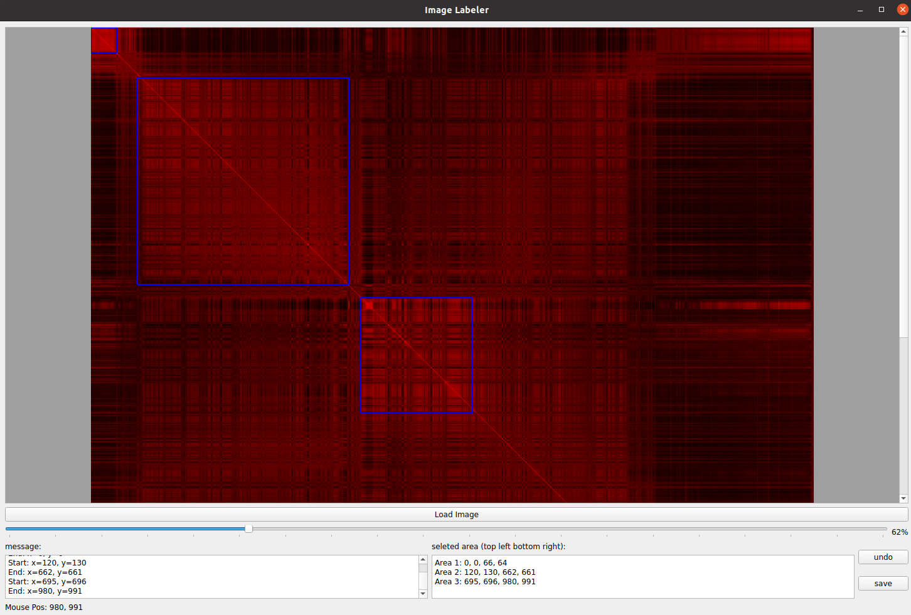

## Introduction
This is a simple image labeling tool that can be used to label images. The tool is written in Python and uses the pyqt5 library for the GUI. You can draw rectangles around the areas of interest and save the coordinates of the rectangles to a file. 

### Motivation
I created this tool to label images based on a practical need. In my case, I obtained a covariance matrix from a set of data points and I wanted to visualize the covariance matrix and obtain the locations of areas with the high covariance. As shown in the image below, the covariance matrix is a 2D matrix and I wanted to visualize the matrix and obtain the locations of the high covariance areas.
<div style="text-align: center;">
    
</div>

### Features
- Load covaraince matrix from a file (all values should be separated by a space)
- Visualize the covariance matrix
- Label the high covariance areas
- Save the labeled areas (top-left and bottom-right coordinates) to a file

#### Other Features
- Zoom in and out
- Pan the image
- undo the rectangle
- __automatically convert the coordinates to the original image coordinates__

### Installation
- Clone the repository
- Install the required packages using the following command
```bash
pip install -r requirements.txt
```

### How to use
- Run the `main.py` file
```bash
python3 main.py
```
- click on the `Load Image` button to load the covariance matrix
- draw a rectangle around the high covariance areas
- click on the `undo` button to remove the last rectangle
- click on the `Save` button to save the labeled areas to a json/txt file


